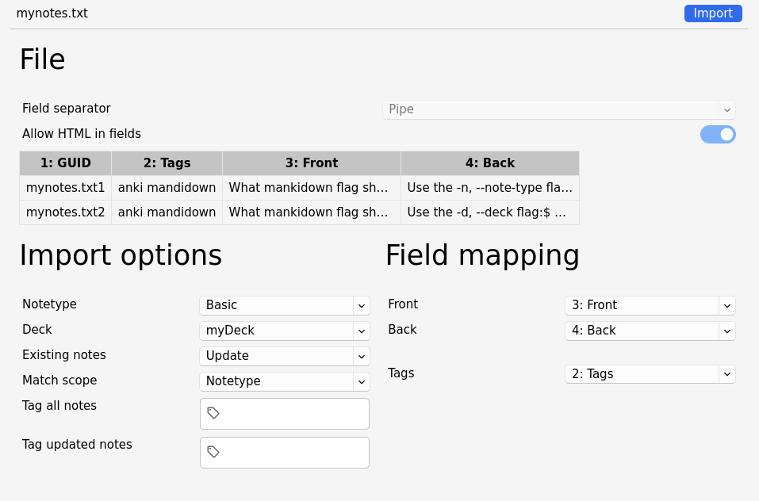

<p align="center"></p>

[](https://pkg.go.dev/github.com/revelaction/mankidown)
[](https://github.com/revelaction/mankidown/actions/workflows/test.yml)
[](https://github.com/revelaction/mankidown/actions/workflows/build.yml)
[](https://goreportcard.com/report/github.com/revelaction/mankidown)
[]() 
[]() 

`mankidown` is a command-line tool to convert [markdown](https://commonmark.org/help/) files to [Anki](https://apps.ankiweb.net/) flashcards 

# Content

- [Features](#features)
- [Documentation](#documentation)
- [Installation](#installation)
- [Usage](#usage)
- [Getting started](#getting-started)
	- [Write notes in markdown](#1-Write-notes-in-markdown)
	- [Run mankidown](#2-run-mankidown)
	- [Anki import](#3-import-the-output-file-in-anki)
- [Examples](#examples)
- [Guid](#anki-guid-handling-by-mankidown)
- [Tags](#tags)
- [Media in notes](#media-in-notes)

# Features 

- **Anki-Ready Output**: mankidown produces plain text files that conform to the requirements of the [Anki import process](https://docs.ankiweb.net/importing/text-files.html). To import your mankidown output into Anki, simply navigate to the File menu and select "Import."
- **Support for Anki Text File Headers**: mankidown supports [Anki text file headers](https://docs.ankiweb.net/importing/text-files.html#file-headers) to streamline the import process. 
- **Markdown to HTML Conversion**: mankidown effortlessly converts your markdown content into HTML, making it readable and accessible in Anki, preserving formatting and layout.
- **Flexible Tagging**: mankidown provides support for both per-file and per-note [Anki tags](https://docs.ankiweb.net/importing/text-files.html#adding-tags). This feature allows you to categorize and organize your notes effectively.
- **Custom Note Types**: mankidown also supports [custom Anki note types](https://docs.ankiweb.net/editing.html#adding-a-note-type). Each note type field is mapped to a markdown H2 Heading element, enabling you to create specialized notes in Anki tailored to your needs.

# Installation

On Linux, macOS, FreeBSD and Windows you can use the [pre-built binaries](https://github.com/revelaction/mankidown/releases/) 

If your system has a supported version of Go, you can build from source

```console
go install github.com/revelaction/mankidown/cmd/mankidown@latest
```

# Usage

```console
# convert to cards for mydeck and Basic note type
mankidown --deck mydeck -n Basic mynotes.md

# Also add tags to all notes
mankidown --deck mydeck -n Basic -t tag1 -t tag2 mynotes.md
```

# Getting started

## 1) Write notes in markdown

Create a markdown file called `mynotes.md` with your favorite editor. The structure of the markdown file is the same regardless of the anki note type. 
In this example, we write two notes for the anki `Basic` Note Type. This note type is the anki default and has two note fields: `Front` and `Back`.

````markdown
# anki mandidown
## Front  

What mankidown flag should you use to indicate the `note type`? 

## Back  

Use the `-n, --note-type` flag:

```
mankidown -n Basic mynotes.md 
```
# anki mandidown
## 

What mankidown flag shoudl you use indicate the `Deck`? 

## 

Use the `-d, --deck` flag:

```
mankidown -d myDeck mynotes.md 
```
````

The markdown file above will create two anki cards for the `Basic` note type.

### mankidown Markdown File Structure

The structure of the mankidown markdown files follows a straightforward pattern:

- Each H1 Heading element serves as an individual Anki note.
- Within the header line of H1 Heading elements, you can include Anki tags, separated by spaces. Anki will automatically apply these tags to the corresponding note.
- H2 Heading elements are imported as Anki note type fields.
- The H2 Headings of the first note should specify the Anki field to be mapped.
- For subsequent notes, the H2 Headings should not include words. Instead, their Anki field is derived from the first note.

See the [markidown format definition](data/examples/mankidown-format.md) in the `data/examples` directory.

## 2) Run mankidown

Run mankidown indicating the Anki note type, the deck, and optional tags:

```console
mankidown --deck mydeck -n Basic mynotes.md
```

This will produce a `mynotes.txt` file that can be imported in Anki.

## 3) Import the output file in anki

In the Anki app, click the File menu and then "Import". For the desktop app:



# Examples

## Basic

There is an [example markdown Basic file](data/examples/basic.md) in the `data/examples` directory.
The anki `Basic` type has two fields: [`Front` and `Back`](https://docs.ankiweb.net/getting-started.html?highlight=Basic#note-types)

You can run the Basic example file like this:

```console
mankidown -d myDeck --note-type Basic data/examples/basic.md 
```

and import the .txt file in anki.

## Cloze

There is an [example markdown Cloze file](data/examples/cloze.md) in the `data/examples` directory.
The anki `Cloze` type has two fields: [`Text` and `Extra`](https://docs.ankiweb.net/editing.html#cloze-deletion)

To write a `Cloze` note just use the anki convention `{{c1::<hidden response>}}` after the `Text` H2 Heading. For example:

````markdown
# 
## Text
Which mankidown flag below should you use to indicate the note type (in this case Cloze):

```console
mankidown --deck mydeck --{{c1::note-type}} Cloze mynotes.md
```
````

You can run the Cloze example file like this:

```console
mankidown -d myDeck -n Cloze data/examples/cloze.md 
```

and import the .txt file in anki.

## Custom

There is an [example markdown Custom file](data/examples/custom.md) in the `data/examples` directory.
The file declares a custom note type with four fields, `Text`, `Question`, `Extra` and `Source`. It also uses [per note GUID](#guid-updating-cards-duplicates).

You can run the Custom example file (assumed you made a anki note type called `Custom`):

```console
mankidown -d myDeck --note-type Custom data/examples/custom.md 
```

and import the .txt file in anki.

## Anki GUID Handling by Mankidown

mankidown employs the [GUID Column](https://docs.ankiweb.net/importing/text-files.html#guid-column) (Globally Unique Identifier) of the Anki import process to ensure organized note management.
When Anki notes are imported from mankidown, the Anki GUID is set by mankidown itself.

mankidown employs two methods to generate GUIDs:

#### Per-Note GUIDs

For precision, each note can declare its own Anki GUID in the H1 header by using the `guid:` prefix, followed by the desired GUID value:

```markdown
# tag1 tag2 guid:563ho8
## Front

## Back
```

In this example, a single Anki note is produced with the GUID `563ho8`.

If you opt for per-note GUIDs, it's essential that every note in the markdown file includes one.

Per-note GUIDs are recommended for maintaining note uniqueness and ensuring smooth Anki integration.

#### Per-Document GUIDs

If individual notes within your markdown file do not include `guid:` values, mankidown will generate a GUID by appending an integer to the name of the markdown file. This integer corresponds to the note's position within the markdown file. For example:

```console
mymarkdownfile.txt0, mymarkdownfile.txt1, mymarkdownfile.txt2
```

However, you have the option to utilize a GUID prefix in place of the file name when executing the command line. This can be achieved with the `-p` or `--guid-prefix` option:

```console
$ mankidown -d myDeck -n Cloze -p myguidprefix data/examples/cloze.md 
```

It's important to note that this method is most effective when there are minimal to no deletions of notes in the document, as such deletions can alter the GUIDs of all subsequent notes, potentially causing loss of card history.

# Tags

[Anki Tags](https://docs.ankiweb.net/editing.html?highlight=tags#using-tags)  offer an effective way to maintain organization within your collection.
mankidown can generate `document tags`  and `note tags`

#### Document Tags

You can utilize the -t or --tag flag in the command line to apply a tag to all notes within a specific document. This flag can be used multiple times to add multiple tags simultaneously. For instance:

```console
$ mankidown --deck mydeck -n Basic -t tag1 -t tag2 mynotes.md
```

In addition, mankidown can automatically derive tags from the words present in the name of the Markdown document. For example, if your markdown file is named english-vocabulary.md, mankidown will automatically assign the english and vocabulary tags to all notes in that file.

#### Note Tags

You can assign tags to individual notes by including them in the title of the H1 tag, separated by spaces. Here's an example:

```markdown
# tag1 tag2
## Front
This is a Basic note with two tags 
## Back

the tags are `tag1` ans `tag2`
```

This allows you to tag your notes directly in your Markdown content for precise and flexible categorization.

# Media in notes

## Images

To incorporate image files into your notes, follow these steps:

1. Place your image files in the Anki [Anki collection.media folder](https://docs.ankiweb.net/files.html#file-locations) folder.

2. In your Markdown file, utilize the standard image format without specifying paths:

    ```
    
    ```

## Audio

For audio files, you can follow a similar approach:

1. Store your audio files in the [Anki collection.media folder](https://docs.ankiweb.net/files.html#file-locations) folder.

2. In your Markdown file, employ the standard audio format without the need for specifying paths:

    ```
    [sound:mysound.mp3]
    ```

# Command line options

```console
mankidown [-d DECK] [-n NOTE-TYPE] [-n GUID-PREFIX] [-t TAG] [-o OUTPUT] INPUT

Options:
    -d, --deck                  The anki deck to import the notes
    -n, --note-type             The anki note type to import the notes
    -o, --output OUTPUT         The OUTPUT file to be imported by Anki 
    -p, --guid-prefix           A prefix to build the guid of all notes note of INPUT
    -t, --tag                   A Tag to all notes of INPUT. Can be repeated 
        --version               The version 

INPUT should be a valid markdown file with the following structure:

- Each H1 Heading element is imported as an Anki card
- H1 Heading elements can contain (in the header line) anki tags separated by space.  
- H2 Heading elements are imported as a "note type" Anki field. 
- The H2 Headings in the first note should contain a word indicating the Anki field to be mapped.
- The H2 Headings in the rest of the notes can not contain words. Its Anki
  field is derived from th first note and its position.

OUTPUT defaults to the basename of INPUT file plus the
extension ".txt". Anki import UI will allow just a list of compatible
extensions, including ".txt". 

If OUTPUT exists, it will be overwritten.

DECK is the anki deck to import the notes. If not set, manual adjustment is
required in the Anki import UI.

NOTE-TYPE is the note type to import the notes. If not set, manual adjustment
is required in the Anki import UI.

TAG is a tag to be applied to all notes of INPUT. The option can be repeated.

GUID-PREFIX is a prefix of the "guid" field for each note in the OUTPUT file.
The "guid" field is unique for each note of INPUT. mankidown will contruct a
guid for each note with the  concatenation of the GUID-PREFIX and a sequence
integer. Anki uses the "guid" to find duplicates and update those notes
preserving schedule times. GUID-PREFIX defaults to OUTPUT.
```
